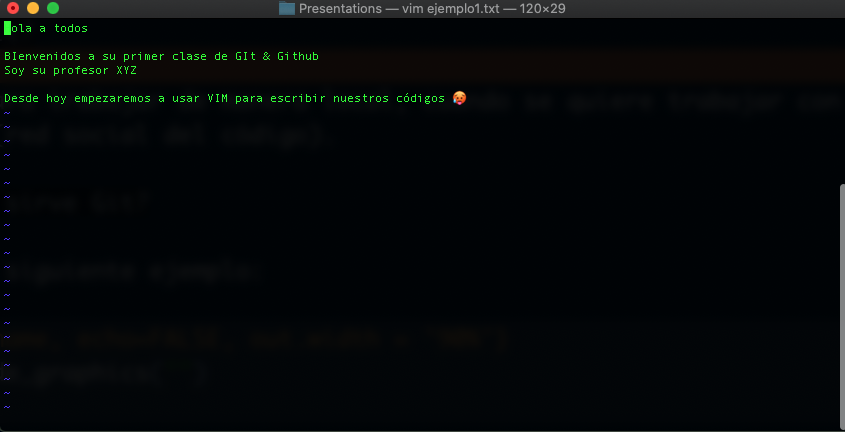
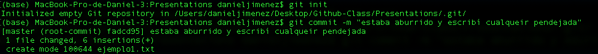
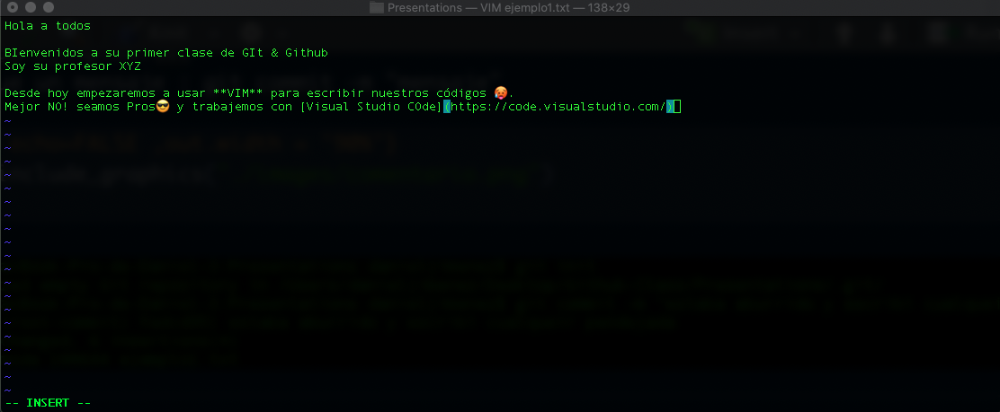
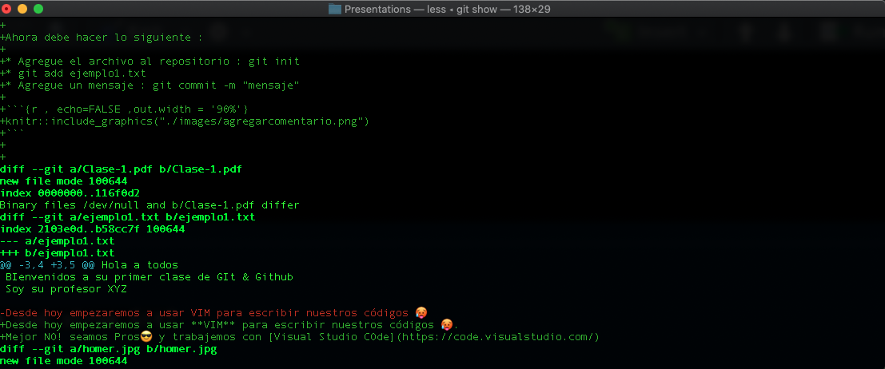
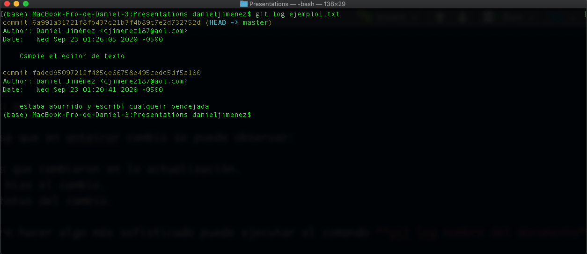
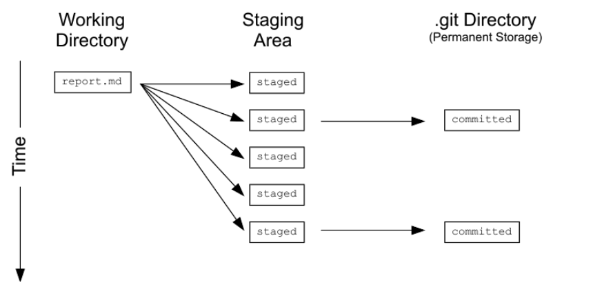
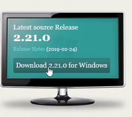

```{r setup, include=FALSE}
knitr::opts_chunk$set(echo = FALSE)
options(knitr.duplicate.label = "allow")
```

## Agenda

* ¿Qué es Git?

* ¿Para qué sirve Git?

* ¿Cómo se instala Git?

* Editores de texto para Git
  
  + Algunas diferencias

* Primeros comandos en Git

* Ejemplo de uso de Git

## ¿Qué es Git?

Según el portal de \textcolor{blue}{\href{https://git-scm.com/}{git}} se define como :

\vspace{1cm}

>"Git is a free and open source distributed version control system designed to handle everything from small to very large projects with speed and efficiency."


## ¿Qué es Git?

Una forma sencilla de entenderlo es definirlo como 

\vspace{1cm}

>"Un sistema que guarda solo los cambios de los archivos, basado en el trabajo colaborativo"


## ¿Qué es Git?

Por lo tanto:

* Es un sistema que permite que multiples personas puedan trabajar en un mismo proyecto;

* El sistema permite retroceder en el nivel de verionamiento tantas veces como se quiera;

* Es posible y sencillo identificar los errores de producción.


## ¿Qué es Git?

Git se usa para trabajar de manera local, cuando se quiere trabajar con varias personas se debe usar github (red social del código).

```{r , echo=FALSE, out.width = '90%'}
knitr::include_graphics("homer.jpg")
```


## ¿Para qué sirve Git?


Imaginesé el siguiente ejemplo:

```{r , echo=FALSE, out.width = '90%'}

```


## ¿Para qué sirve Git?


Ahora debe hacer lo siguiente :

* Agregue el archivo al repositorio : git init
* git add ejemplo1.txt
* Agregue un mensaje : git commit -m "mensaje"

```{r , echo=FALSE ,out.width = '90%'}

```

## ¿Para qué sirve Git?

Ahora suponga que quiere hacer unos cambios que son importantes.

```{r , echo=FALSE ,out.width = '90%'}

```


## ¿Para qué sirve Git?


Ahora :

* Agregar todos los cambios : git add . {ojo que los espacios son importantes}

* Comentar los cambios : git commit -m "Cambie el editor de texto"

* Verifica el estatus de cambio : git status

```{r , echo=FALSE ,out.width = '90%'}

```


## ¿Para qué sirve Git?

Observese que en anteiror cambio se puede observar:

* Lineas que cambiaron en la actualización.
* Quien hizo el cambio.
* el estatus del cambio.

Si quiere hacer algo más sofisticado puede ejecutar el comando **git log nombre del documento**

## ¿Para qué sirve Git?

```{r , echo=FALSE ,out.width = '90%'}

```

😎

## ¿Para qué sirve Git?

Como tal Git es un sistema de control distribuido ¿Qué quiere decir eso?

> "La mayoría de los sistemas de control de versiones utilizan un servidor centralizado para guardar todos los cambios y actualizaciones. Esta característica es maravillosa porque permite que personas en diferentes partes del mundo puedan trabajar sobre un mismo proyecto, sin embargo está fuertemente atada a la conexión a Internet para funcionar, de otra manera los cambios nunca podrán reflejarse en el servidor central."


## ¿Para qué sirve Git?


"Git se presenta como un sistema distribuido, en el que todos los nodos manejan la información en su totalidad y por lo tanto pueden actuar de cliente o servidor en cualquier momento, es decir, se elimina el concepto de “centralizado”. Esto se lo logra gracias a que cada vez que sincronizas los cambios con el repositorio remoto Git, te guarda una copia entera de los datos con toda la estructura y los archivos necesarios. Así ya no es necesario salir a Internet para consultar los cambios históricos sobre un archivo o para ver quién fue la última persona que lo editó, todo se hace directamente sobre tu copia local y luego, cuando lo consideres oportuno, puedes enviar esos cambios hacia el repositorio remoto." \footnote{tomado de la página de Git}

## ¿Para qué sirve Git?

Dicho lo anterior Git sirve para :

* Cada uno de los miembros del equipo tenga una versión local de un proyecto;

* Crear ramificaciones del proyecto;

* Integrar las partes del proyecto (pull request, no lo haga de otra manera por higiene del repositorio 🤓)

## ¿Para qué sirve Git?


### Algunas definiciones necesarias

* Repositorio: Lugar donde se almacena los datos actualizados y la historia de los mismos (versiones) con respecto a sus cambios.

* Revisión: Versión determinada de la información que se gestiona.

* Tag: Son etiquetas que permiten identificar de forma fácil las partes y versiones de un proyecto.

* Change:Modificación especifica a un documento o código.

## ¿Para qué sirve Git?

### Algunas definiciones necesarias

* Branch: Conjunto de archivos que pueden ser ramificados. 

* Checkout: Crear una copia local desde el repositorio.

* Commit : Leyenda de los cambios 

* Conflict : Conflicto cuando varias partes hacen cambios en la misma parte del código o repositorio.

* Merge : Integrar.

## ¿Para qué sirve Git?

Lo anterior sirve para validar el siguiente flujo

```{r , echo=FALSE ,out.width = '90%'}

```


## ¿Cómo se instala Git?


* Para el caso de Windows, diríjase a la página de git haciendo click [aquí](https://git-scm.com/)


```{r , echo=FALSE ,out.width = '90%'}

```


Siga los pasos y confie en la gente de LiNux


## ¿Cómo se instala Git?

* En el caso de Mac, ya viene instalado,pero por si algo haga click [aquí](https://git-scm.com/)


```{r , echo=FALSE ,out.width = '90%'}

```

Descargue y siga los pasos mencionados en el proceso de instalación.

## ¿Cómo se instala Git?

Observación:

* Para sacarle el provecho a git y a su máquina trabaje desde la terminal o CMD

* Existen varios editores de texto, pero tenga presente que cada uno tiene una función

* VIM es un editor difícil de manejar, pero optimizado para el trabajo de máquina.


