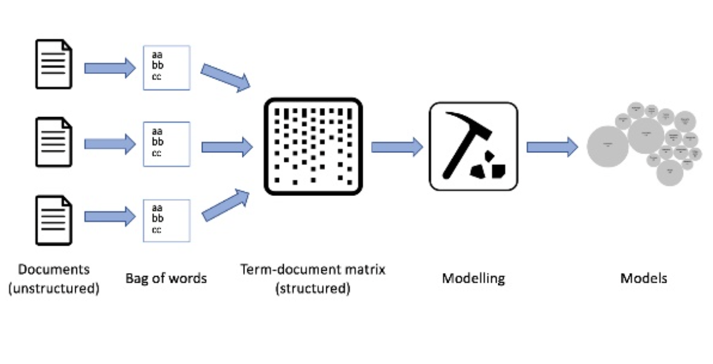

```{r setup, include=FALSE}
knitr::opts_chunk$set(echo = TRUE)
```

## Bibliográfia

* Ingo Feinerer, [**Introduction to the tm Package**](https://cran.r-project.org/web/packages/tm/vignettes/tm.pdf), 2019, CRAN.

* Julia Silge & David Robinson, [**Text Mining with R**](https://www.tidytextmining.com/), 2020, O'Reilly.

* Christopher D. Manning, [**Foundations os Statistical Natuale Lenguaje Processing**](cs.vassar.edu/~cs366/docs/Manning_Schuetze_StatisticalNLP.pdf), 1999, MIT.

* Ted Kwartler, [**Text Mining in Practice with R**](https://www.amazon.com/-/es/Ted-Kwartler/dp/1119282012), 2017, Wiley.


## Requisitos para la clase 

Para esta clase es necesario que tengan instaladas y funcionales las siguientes liberías:

```{r, eval=FALSE}
library(tidyverse) # Manipulación de datos
library(tidytext) # Manipulación de textos
library(tm) #  Procesamiento de mega-data y creación de corpus
library(topicmodels) # Agrupación de textos por tema
library(wordcloud) # Nube de palabras
```


## ¿Qué es el Text Mining?

Es un área de la ciencia de datos que estudia los documentos de naturaleza texto (Datos no estructurados), en el cual se explora su naturaleza, patrones, contenido y sentido.

## ¿Qué es el Text Mining?

Los objetivos del `text mining` son :

* Comprender la naturaleza de los documentos;
* Esta comprensión se basa en patrones estadísticos;
* Con base a los elementos estadísticos se deben encontran patrones no evidentes entre los datos.

## ¿Qué es el Text Mining?

Para poder desarrollar Text Mining hay que comprender que este proceso se divide generalmente en tres capas:

* Análisis de documentos;
* Topic Modelling;
* Machine Learning 

## Análisis de documentos

Para entender un poco esta parte, se desarrollará un ejemplo y sobre el definiremos los pasos que se implementaron para llegar a esta conclusión.

El ejemplo será analizar la canción *Hawai* de Maluma, en el repositorio, en la sección `Bases de Datos`

## Análisis de documentos

El proceso natural del `text mining` es el siguiente :




## Hawai en Text Mining

Lo primero a trabajar es el cargue de la base de datos

```{r, echo=FALSE, message=FALSE,warning=FALSE}
library(tidyverse) # Manipulación de datos
library(tidytext) # Manipulación de textos
library(tm) #  Procesamiento de mega-data y creación de corpus
library(topicmodels) # Agrupación de textos por tema
library(wordcloud) # Nube de palabras
library(ggraph)
library(ggrepel)
library(widyr)
library(stopwords)
library(tidygraph)
library(stm)
stop_words_es<-stopwords::stopwords(language = "spanish")
hawai<-read_csv('../Bases_de_datos/hawai.txt',col_names = FALSE)%>%
  rename(Letra=X1)
```


```{r, eval=FALSE}
hawai<-read_csv('../Bases_de_datos/hawai.txt',col_names = FALSE)%>%
  rename(Letra=X1)
```
```{r, echo=FALSE}
hawai%>%
  head()
```

## Hawai en Text Mining

Paso seguido hay que convertirlo en una base de datos y eso se hace asignandole un # de lineas y dandole el formato de chr a las frases.

```{r, eval=FALSE}
hawai_df<-hawai%>%
  tibble(line=1:50,texto=Letra)
```


```{r, echo=FALSE}
hawai_df<-hawai%>%
  tibble(line=1:50,texto=Letra)

hawai_df%>%
  head()
```
## Contexto

Cuando trabajamos con bases de datos textuales, hay que hacer es generar un formato en el cual se pueda trabajar y es ahí cuando entra la teoría de las bases de datos, puntualmente sobre estructuras de datos.


## Hawai en Text Mining

Ahora se tokeniza la canción para poder a organizar la data y desarrollar el análisis

```{r}
hawai_df%>%
  unnest_tokens(word,Letra)%>%
  filter(!word %in% stop_words_es)%>%
  count(word,sort=TRUE)
```

## Hawai en Text Mining

```{r,echo=FALSE, fig.height=4,message=FALSE}
hawai_df%>%
  unnest_tokens(word,Letra)%>%
  filter(!word %in% stop_words_es)%>%
  count(word,sort=TRUE)%>%
  mutate(word=fct_reorder(word,n))%>%
  top_n(20)%>%
  ggplot(aes(n,word))+
  geom_col()+
  labs(title = 'Base de datos sucia',
       subtitle = 'De esta forma no se debe análizar un texto')
```


## Contexto

En los pasos anteriores se incurrio en un proceso donde se desarrollo 

* El orden de la base de datos ;
* Se genero los string de la manera como se deseaba, en este caso por palabras


## Contexto

Finalmente se desarrollo un proceso de tokenizar, el cual consiste en divir el documento en un token el cual es una unidad de medida de partición que se hace al antojo, pero puede ser :

* Palabras
* Regex
* Sentencias
* Párrafos

Y de esta manera se le da una estructura de la base de datos, lo cual nos asegura que se puede empezar a trabajar con este tipo de data.


## Hawai en Text Mining

Se remueven los stop words

```{r, echo=FALSE,fig.height=4,message=FALSE,warning=FALSE}
hawai_df%>%
  unnest_tokens(word,Letra)%>%
  filter(!word %in% stop_words_es)%>%
  mutate(word=gsub('\\b[[:alpha:]]{1,3}\\b','',word))%>%
  filter(word!='')%>%
  count(word,sort=TRUE)%>%
  mutate(word=fct_reorder(word,n))%>%
  top_n(20)%>%
  ggplot(aes(n,word))+
  geom_col()+
  labs(title = 'Frecuencia de las palabras más usadas',
       subtitle = 'En la canción de Hawai')
```


## Contexto


Paso seguido se trabaja en la limpieza de los datos y es a través de los stop words, palabras que son contectores y no le dan sentido al contexto del análisis .


## Hawai en Text Mining


Ahora se evalua la relación de frecuencia del uso de palabras en el contexto del párrafo a través de la ley de  Zipf.

```{r, echo=FALSE, message=FALSE,warning=FALSE,fig.height=4}
total_words<-hawai_df%>%
  unnest_tokens(word,Letra)%>%
  count(word,sort=TRUE)
total_words<-sum(total_words$n) 

freq_words<-hawai_df%>%
  unnest_tokens(word,Letra)%>%
  filter(!word %in% stop_words_es)%>%
  mutate(word=gsub('\\b[[:alpha:]]{1,3}\\b','',word))%>%
  filter(word!='')%>%
  count(word,sort=TRUE)%>%
  mutate(rank=row_number(),
         frequency=n/total_words)

freq_words %>%
  ggplot(aes(rank,frequency , group=1)) +
  geom_line(size = 1.1, alpha = 0.8, show.legend = FALSE) +
  labs(title = 'Relación en el uso de palabras con pendiente Negativa',
       subtitle = 'en la canción Hawai')
```


## Contexto

La ley de Zipf consiste en la relación matemática del uso frecuente de palabras a través de su patron de uso.

En 1940, George Zipf encontro que la palabra más usadas en un documento tiende a ser el doble de la segunda más usada y la tercera más usada un tercio de la segunda y así entendio la sucesión. 

Por lo tanto la relación que encontro Zipf es la siguiente:
> La frecuencia de aparición de una palabra es proporcional al inversio de la prosición que ocupa.


$$
\mbox{ freq =}  \infty \frac{1}{ranking}
$$


## Hawai en Text Mining

```{r, echo=FALSE, fig.height=4,message=FALSE,warning=FALSE}
freq_words %>%
  ggplot(aes(rank,frequency , group=1)) +
  geom_abline(intercept = 0.01, slope = -0.0001469 , color = "gray50", linetype = 2) +
  geom_line(size = 1.1, alpha = 0.8, show.legend = FALSE) +
  # scale_x_log10() +
  # scale_y_log10()+
  labs(title = 'Relación en el uso de palabras con pendiente Negativa',
       subtitle = 'en la canción Hawai')
```


Gracias a esta relación se puede determinar la inversa se cumple y con ello se puede determinar lo siguiente 


## Hawai en Text Mining

El modelo matemático de la canción es el siguiente

```{r}
fit<-lm(frequency~rank,data=freq_words)
```

$$
\operatorname{frequency} = 0.01 + 0(\operatorname{rank}) + \epsilon
$$

Con esto ya se tiene construido el modelo matemático de la linguistica de la canción.

## Hawai en Text Mining


```{r, echo=FALSE, message=FALSE,warning=FALSE}
freq_words %>%
  with(wordcloud(word, n, max.words = 100))
```


## Contexto

La relación anterior es el constructo matemático de la lingüística de la canción, gracias a ello podemos entender el contexto del wordcloud. Esta última visualización  describe a las palabras más frecuentes dentro de un texto, pero si se le suma la ley de Zipf, el patron que se encuentra es que después de estas palabras, el resto de la canción son los conductores del contexto.


## Hawai en Text Mining

Ahora dejamos de lado la frecuencia de las palabras y desarollamos un análisis en el cual se resalta la importancia de las palabras y con base a ello se le da un peso


```{r,echo=FALSE,message=FALSE,warning=FALSE, fig.height=4}
freq_words<-hawai_df%>%
  unnest_tokens(word,Letra)%>%
  filter(!word %in% stop_words_es)%>%
  mutate(word=gsub('\\b[[:alpha:]]{1,3}\\b','',word))%>%
  filter(word!='')%>%
  count(word,sort=TRUE)

hawai_tf_idf<-freq_words%>%
  left_join(hawai_df%>%
  unnest_tokens(word,Letra)%>%
  filter(!word %in% stop_words_es)%>%
  mutate(word=gsub('\\b[[:alpha:]]{1,3}\\b','',word))%>%
  filter(word!=''), by='word')%>%
  distinct(word,.keep_all = TRUE)%>%
  bind_tf_idf(word, line, n)%>%
  select(-texto)

hawai_tf_idf%>%
  arrange(desc(tf_idf))%>%
  mutate(word=fct_reorder(word,tf_idf))%>%
  top_n(15)%>%
  ggplot(aes(tf_idf,word,fill=tf_idf))+
  geom_col()+
  labs(title = 'Entendimiento por nivel de importancia de las palabras',
       subtitle = 'En la canción')
```

## Contexto


Para entender de que trata un texto es necesario cuantificar ciertos aspectos :

* tf : Frecuencia de la palabra;
* tf-idf: Frecuencia inversa de un termino, permite reducir el peso de las palabras que más se usan y darle peso a las que más generan contexto

## Contexto


Por lo tanto

$$
tf = \frac{f(t,d)}{max\{f(t,d) \in d\}}
$$


Mientras que 

$$
idf(t,D) = log \frac{|D|}{\{d \in D : t\in d\}}
$$
Donde `d` es la probabilidad de ocurrencia de una palabra dentro del texto, `D` es la cardinalidad de una palabra dentro del documento y $\{d \in D : t\in d\}$ Número de documentos donde aparece el termino `t`.

## Hawai en Text Mining

Ahora se trabaja en el desarrollo de n-grams

```{r,eval=FALSE}
hawai_ngram<-hawai_df%>%
  unnest_tokens(ngram,Letra,token = 'ngrams',n=2)

hawai_ngram%>%
  count(ngram,sort=TRUE)%>%
  filter(!is.na(ngram))
```


## Hawai en Text Mining

```{r,echo=FALSE}
hawai_ngram<-hawai_df%>%
  unnest_tokens(ngram,Letra,token = 'ngrams',n=2)

hawai_ngram%>%
  count(ngram,sort=TRUE)%>%
  filter(!is.na(ngram))%>%
  head(4)
```


