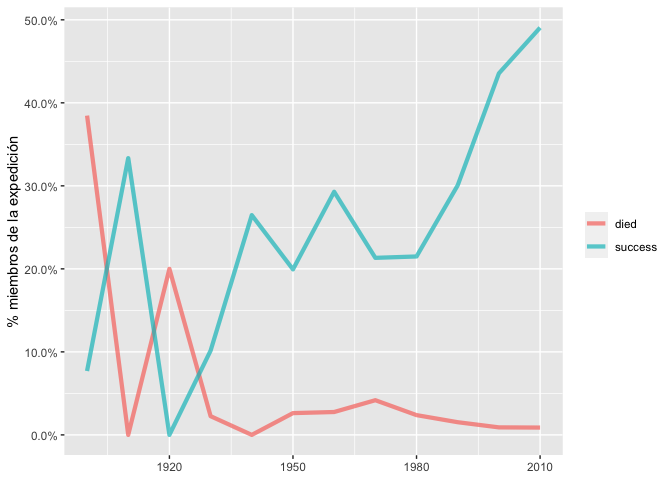
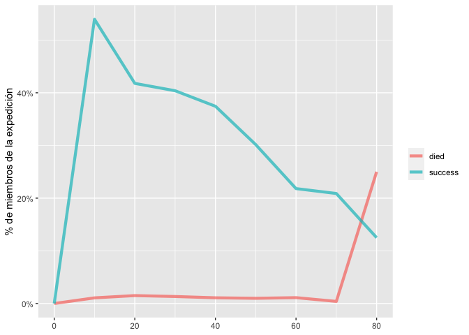
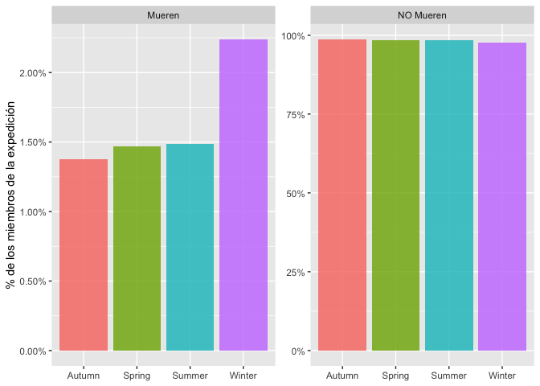
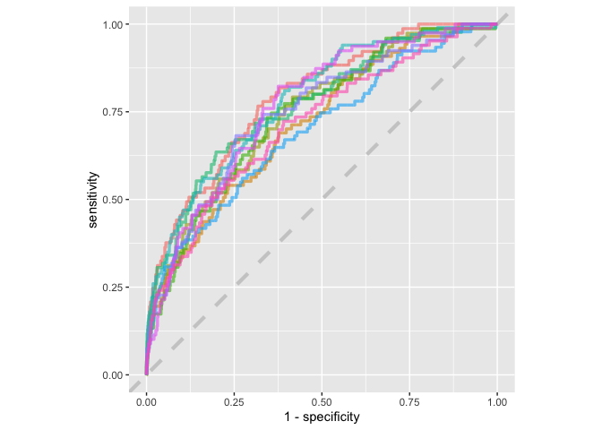

Machine Learning Aplicado
================

## Machine Learning aplicado a la clasificación

En esta parte desarrollaremos un poco de Data Science con Machine
Learning

## librerías

``` r
library(tidyverse)
library(tidymodels)
library(themis)
library(knitr)
```

## Base de datos

``` r
members <- read_csv("https://raw.githubusercontent.com/rfordatascience/tidytuesday/master/data/2020/2020-09-22/members.csv")
```

``` r
members
```

    ## # A tibble: 76,519 x 21
    ##    expedition_id member_id peak_id peak_name  year season sex     age
    ##    <chr>         <chr>     <chr>   <chr>     <dbl> <chr>  <chr> <dbl>
    ##  1 AMAD78301     AMAD7830… AMAD    Ama Dabl…  1978 Autumn M        40
    ##  2 AMAD78301     AMAD7830… AMAD    Ama Dabl…  1978 Autumn M        41
    ##  3 AMAD78301     AMAD7830… AMAD    Ama Dabl…  1978 Autumn M        27
    ##  4 AMAD78301     AMAD7830… AMAD    Ama Dabl…  1978 Autumn M        40
    ##  5 AMAD78301     AMAD7830… AMAD    Ama Dabl…  1978 Autumn M        34
    ##  6 AMAD78301     AMAD7830… AMAD    Ama Dabl…  1978 Autumn M        25
    ##  7 AMAD78301     AMAD7830… AMAD    Ama Dabl…  1978 Autumn M        41
    ##  8 AMAD78301     AMAD7830… AMAD    Ama Dabl…  1978 Autumn M        29
    ##  9 AMAD79101     AMAD7910… AMAD    Ama Dabl…  1979 Spring M        35
    ## 10 AMAD79101     AMAD7910… AMAD    Ama Dabl…  1979 Spring M        37
    ## # … with 76,509 more rows, and 13 more variables: citizenship <chr>,
    ## #   expedition_role <chr>, hired <lgl>, highpoint_metres <dbl>, success <lgl>,
    ## #   solo <lgl>, oxygen_used <lgl>, died <lgl>, death_cause <chr>,
    ## #   death_height_metres <dbl>, injured <lgl>, injury_type <chr>,
    ## #   injury_height_metres <dbl>

Un poco de diseño de experimento

  - ¿Cómo cambia la tasa de éxito de la expedición y la muerte de los
    miembros?

<!-- end list -->

``` r
members %>%
  group_by(year = 10 * (year %/% 10)) %>% # Se crean decadas
  summarise(
    died = mean(died),
    success = mean(success)
  ) %>%
  pivot_longer(died:success, names_to = "outcome", values_to = "percent") %>%
  ggplot(aes(year, percent, color = outcome)) +
  geom_line(alpha = 0.7, size = 1.5) +
  scale_y_continuous(labels = scales::percent_format()) +
  labs(x = NULL, y = "% miembros de la expedición", color = NULL)
```

<!-- -->

  - ¿Cómo es el efecto de la edad de los miembros del equipo y la tasa
    de muertes?

<!-- end list -->

``` r
members %>%
  group_by(age = 10 * (age %/% 10)) %>%
  summarise(
    died = mean(died),
    success = mean(success)
  ) %>%
  pivot_longer(died:success, names_to = "outcome", values_to = "percent") %>%
  ggplot(aes(age, percent, color = outcome)) +
  geom_line(alpha = 0.7, size = 1.5) +
  scale_y_continuous(labels = scales::percent_format()) +
  labs(x = NULL, y = "% de miembros de la expedición", color = NULL)
```

<!-- -->

  - ¿Cuál es el porcentaje de que las personas mueran cuando la misión
    es fallida?

<!-- end list -->

``` r
members %>%
  count(success, died) %>%
  group_by(success) %>%
  mutate(percent = scales::percent(n / sum(n))) %>%
  kable(
    col.names = c("Exito de la expedición", "Murio", "Número de personas", "% del equipo"),
    align = "llrr"
  )
```

| Exito de la expedición | Murio | Número de personas | % del equipo |
| :--------------------- | :---- | -----------------: | -----------: |
| FALSE                  | FALSE |              46452 |          98% |
| FALSE                  | TRUE  |                868 |           2% |
| TRUE                   | FALSE |              28961 |          99% |
| TRUE                   | TRUE  |                238 |           1% |

``` r
members %>%
  filter(season != "Unknown") %>%
  count(season, died) %>%
  group_by(season) %>%
  mutate(
    percent = n / sum(n),
    died = case_when(
      died ~ "Mueren",
      TRUE ~ "NO Mueren"
    )
  ) %>%
  ggplot(aes(season, percent, fill = season)) +
  geom_col(alpha = 0.8, position = "dodge", show.legend = FALSE) +
  scale_y_continuous(labels = scales::percent_format()) +
  facet_wrap(~died, scales = "free") +
  labs(x = NULL, y = "% de los miembros de la expedición")
```

<!-- -->

Se crea una base de datos

``` r
members_df <- members %>%
  filter(season != "Unknown", !is.na(sex), !is.na(citizenship)) %>%
  select(peak_id, year, season, sex, age, citizenship, hired, success, died) %>%
  mutate(died = case_when(
    died ~ "muere",
    TRUE ~ "vive"
  )) %>%
  mutate_if(is.character, factor) %>%
  mutate_if(is.logical, as.integer)
```

## Se crea un modelo

``` r
library(tidymodels)

set.seed(123)
members_split <- initial_split(members_df, strata = died)
members_train <- training(members_split)
members_test <- testing(members_split)
members_folds <- vfold_cv(members_train, strata = died)
```

``` r
members_rec <- recipe(died ~ ., data = members_train) %>%
  step_medianimpute(age) %>%
  step_other(peak_id, citizenship) %>%
  step_dummy(all_nominal(), -died) %>%
  step_smote(died)
```

Se crean dos modelos

``` r
glm_spec <- logistic_reg() %>%
  set_engine("glm")

rf_spec <- rand_forest(trees = 1000) %>%
  set_mode("classification") %>%
  set_engine("ranger")
```

Se agrega un workflow

``` r
members_wf <- workflow() %>%
  add_recipe(members_rec)
```

``` r
members_metrics <- metric_set(roc_auc, accuracy, sensitivity, specificity,precision,recall)
doParallel::registerDoParallel()
glm_rs <- members_wf %>%
  add_model(glm_spec) %>%
  fit_resamples(
    resamples = members_folds,
    metrics = members_metrics,
    control = control_resamples(save_pred = TRUE)
  )

glm_rs%>%
  unnest(.metrics)%>%
  filter(.metric=='accuracy')%>%
  arrange(desc(.estimate))
```

    ## # A tibble: 10 x 7
    ##    splits        id     .metric  .estimator .estimate .notes     .predictions   
    ##    <list>        <chr>  <chr>    <chr>          <dbl> <list>     <list>         
    ##  1 <split [51.6… Fold10 accuracy binary         0.633 <tibble [… <tibble [5,738…
    ##  2 <split [51.6… Fold09 accuracy binary         0.633 <tibble [… <tibble [5,738…
    ##  3 <split [51.6… Fold05 accuracy binary         0.627 <tibble [… <tibble [5,738…
    ##  4 <split [51.6… Fold04 accuracy binary         0.621 <tibble [… <tibble [5,738…
    ##  5 <split [51.6… Fold08 accuracy binary         0.619 <tibble [… <tibble [5,738…
    ##  6 <split [51.6… Fold01 accuracy binary         0.617 <tibble [… <tibble [5,739…
    ##  7 <split [51.6… Fold07 accuracy binary         0.616 <tibble [… <tibble [5,738…
    ##  8 <split [51.6… Fold03 accuracy binary         0.615 <tibble [… <tibble [5,738…
    ##  9 <split [51.6… Fold02 accuracy binary         0.610 <tibble [… <tibble [5,738…
    ## 10 <split [51.6… Fold06 accuracy binary         0.606 <tibble [… <tibble [5,738…

Agregamos al segundo modelo

``` r
rf_rs <- members_wf %>%
  add_model(rf_spec) %>%
  fit_resamples(
    resamples = members_folds,
    metrics = members_metrics,
    control = control_resamples(save_pred = TRUE)
  )
```

Se recolectan todas las métricas

``` r
collect_metrics(glm_rs)
```

    ## # A tibble: 6 x 5
    ##   .metric   .estimator   mean     n  std_err
    ##   <chr>     <chr>       <dbl> <int>    <dbl>
    ## 1 accuracy  binary     0.620     10 0.00286 
    ## 2 precision binary     0.0249    10 0.000930
    ## 3 recall    binary     0.673     10 0.0168  
    ## 4 roc_auc   binary     0.706     10 0.00719 
    ## 5 sens      binary     0.673     10 0.0168  
    ## 6 spec      binary     0.619     10 0.00300

``` r
collect_metrics(rf_rs)
```

    ## # A tibble: 6 x 5
    ##   .metric   .estimator  mean     n  std_err
    ##   <chr>     <chr>      <dbl> <int>    <dbl>
    ## 1 accuracy  binary     0.972    10 0.000749
    ## 2 precision binary     0.131    10 0.0105  
    ## 3 recall    binary     0.168    10 0.0120  
    ## 4 roc_auc   binary     0.747    10 0.00998 
    ## 5 sens      binary     0.168    10 0.0120  
    ## 6 spec      binary     0.984    10 0.000608

Se evalua el nivel de predicción del modelo

``` r
glm_rs %>%
  conf_mat_resampled()
```

    ## # A tibble: 4 x 3
    ##   Prediction Truth   Freq
    ##   <fct>      <fct>  <dbl>
    ## 1 muere      muere   55.1
    ## 2 muere      vive  2156. 
    ## 3 vive       muere   26.9
    ## 4 vive       vive  3500.

``` r
rf_rs %>%
  conf_mat_resampled()
```

    ## # A tibble: 4 x 3
    ##   Prediction Truth   Freq
    ##   <fct>      <fct>  <dbl>
    ## 1 muere      muere   13.9
    ## 2 muere      vive    92.1
    ## 3 vive       muere   68.1
    ## 4 vive       vive  5564

Dibujamos la ROC

``` r
rf_rs %>%
  collect_predictions() %>%
  group_by(id) %>%
  roc_curve(died, .pred_muere) %>%
  ggplot(aes(1 - specificity, sensitivity, color = id)) +
  geom_abline(lty = 2, color = "gray80", size = 1.5) +
  geom_path(show.legend = FALSE, alpha = 0.6, size = 1.2) +
  coord_equal()
```

<!-- -->

Se evalua al modelo

``` r
members_final <- members_wf %>%
  add_model(rf_spec) %>%
  last_fit(members_split)
```

``` r
collect_metrics(members_final)
```

    ## # A tibble: 2 x 3
    ##   .metric  .estimator .estimate
    ##   <chr>    <chr>          <dbl>
    ## 1 accuracy binary         0.971
    ## 2 roc_auc  binary         0.747

``` r
collect_predictions(members_final) %>%
  conf_mat(died, .pred_class)
```

    ##           Truth
    ## Prediction muere  vive
    ##      muere    32   294
    ##      vive    254 18546
