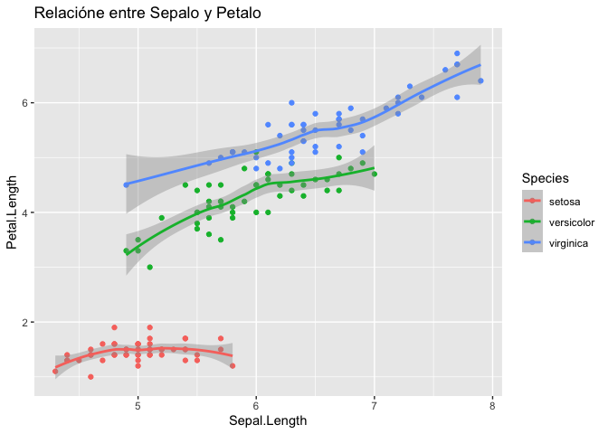
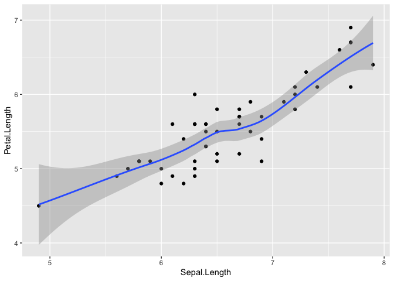

Tutoria \# 2 NLP
================

## ¿Cómo gestionar proyectos con datos?

  - Anotación especial: un chunk se abre bajo la combinación de
    `control` + `alt` + `i`
  - Si usted usa un MAC el comando para el chunk es `cmd` + `alt` + `i`

<!-- end list -->

``` r
library(tidyverse)
library(skimr)
library(knitr)
```

## Cargar una base de datos

``` r
iris%>%
  head()%>%# Función para ver la cabecera de la base de datos 
  kable(format = 'markdown',caption = 'Primer vista de Iris')
```

| Sepal.Length | Sepal.Width | Petal.Length | Petal.Width | Species |
| -----------: | ----------: | -----------: | ----------: | :------ |
|          5.1 |         3.5 |          1.4 |         0.2 | setosa  |
|          4.9 |         3.0 |          1.4 |         0.2 | setosa  |
|          4.7 |         3.2 |          1.3 |         0.2 | setosa  |
|          4.6 |         3.1 |          1.5 |         0.2 | setosa  |
|          5.0 |         3.6 |          1.4 |         0.2 | setosa  |
|          5.4 |         3.9 |          1.7 |         0.4 | setosa  |

Primer vista de Iris

## Conocer la naturaleza de los datos

``` r
iris%>%
  glimpse() # Forma dplyr de ver los datos
```

    ## Rows: 150
    ## Columns: 5
    ## $ Sepal.Length <dbl> 5.1, 4.9, 4.7, 4.6, 5.0, 5.4, 4.6, 5.0, 4.4, 4.9, 5.4, 4…
    ## $ Sepal.Width  <dbl> 3.5, 3.0, 3.2, 3.1, 3.6, 3.9, 3.4, 3.4, 2.9, 3.1, 3.7, 3…
    ## $ Petal.Length <dbl> 1.4, 1.4, 1.3, 1.5, 1.4, 1.7, 1.4, 1.5, 1.4, 1.5, 1.5, 1…
    ## $ Petal.Width  <dbl> 0.2, 0.2, 0.2, 0.2, 0.2, 0.4, 0.3, 0.2, 0.2, 0.1, 0.2, 0…
    ## $ Species      <fct> setosa, setosa, setosa, setosa, setosa, setosa, setosa, …

``` r
glimpse(iris) # Estructura clásica de programación 
```

    ## Rows: 150
    ## Columns: 5
    ## $ Sepal.Length <dbl> 5.1, 4.9, 4.7, 4.6, 5.0, 5.4, 4.6, 5.0, 4.4, 4.9, 5.4, 4…
    ## $ Sepal.Width  <dbl> 3.5, 3.0, 3.2, 3.1, 3.6, 3.9, 3.4, 3.4, 2.9, 3.1, 3.7, 3…
    ## $ Petal.Length <dbl> 1.4, 1.4, 1.3, 1.5, 1.4, 1.7, 1.4, 1.5, 1.4, 1.5, 1.5, 1…
    ## $ Petal.Width  <dbl> 0.2, 0.2, 0.2, 0.2, 0.2, 0.4, 0.3, 0.2, 0.2, 0.1, 0.2, 0…
    ## $ Species      <fct> setosa, setosa, setosa, setosa, setosa, setosa, setosa, …

## Comprender una base de datos

1)  La base de datos esta completa ?

<!-- end list -->

``` r
iris%>%
  skim() # con esta función se logro entender la naturaleza de los datos.
```

|                                                  |            |
| :----------------------------------------------- | :--------- |
| Name                                             | Piped data |
| Number of rows                                   | 150        |
| Number of columns                                | 5          |
| \_\_\_\_\_\_\_\_\_\_\_\_\_\_\_\_\_\_\_\_\_\_\_   |            |
| Column type frequency:                           |            |
| factor                                           | 1          |
| numeric                                          | 4          |
| \_\_\_\_\_\_\_\_\_\_\_\_\_\_\_\_\_\_\_\_\_\_\_\_ |            |
| Group variables                                  | None       |

Data summary

**Variable type: factor**

| skim\_variable | n\_missing | complete\_rate | ordered | n\_unique | top\_counts               |
| :------------- | ---------: | -------------: | :------ | --------: | :------------------------ |
| Species        |          0 |              1 | FALSE   |         3 | set: 50, ver: 50, vir: 50 |

**Variable type: numeric**

| skim\_variable | n\_missing | complete\_rate | mean |   sd |  p0 | p25 |  p50 | p75 | p100 | hist  |
| :------------- | ---------: | -------------: | ---: | ---: | --: | --: | ---: | --: | ---: | :---- |
| Sepal.Length   |          0 |              1 | 5.84 | 0.83 | 4.3 | 5.1 | 5.80 | 6.4 |  7.9 | ▆▇▇▅▂ |
| Sepal.Width    |          0 |              1 | 3.06 | 0.44 | 2.0 | 2.8 | 3.00 | 3.3 |  4.4 | ▁▆▇▂▁ |
| Petal.Length   |          0 |              1 | 3.76 | 1.77 | 1.0 | 1.6 | 4.35 | 5.1 |  6.9 | ▇▁▆▇▂ |
| Petal.Width    |          0 |              1 | 1.20 | 0.76 | 0.1 | 0.3 | 1.30 | 1.8 |  2.5 | ▇▁▇▅▃ |

2)  Análisis Exploratorio de datos

<!-- end list -->

``` r
cor(iris[,-5])
```

    ##              Sepal.Length Sepal.Width Petal.Length Petal.Width
    ## Sepal.Length    1.0000000  -0.1175698    0.8717538   0.8179411
    ## Sepal.Width    -0.1175698   1.0000000   -0.4284401  -0.3661259
    ## Petal.Length    0.8717538  -0.4284401    1.0000000   0.9628654
    ## Petal.Width     0.8179411  -0.3661259    0.9628654   1.0000000

¿Cómo es la relación del largo del sepalo con respecto al largo del
petalo?

``` r
iris%>%
  ggplot(aes(Sepal.Length ,Petal.Length,color=Species))+ # este comando se uiliza para diseñar las gráficas
  geom_point()+ # hacer gráfico de puntos 
  geom_smooth() + # mostrar tendencia 
  labs(title = "Relacióne entre Sepalo y Petalo")
```

    ## `geom_smooth()` using method = 'loess' and formula 'y ~ x'

<!-- -->

## Funciones Lógicas

La función `for` sirve para enlistar un número de sentencias
(operaciones), esto quiere decir, para cada uno de los elementos de
**iris especies** imprime el nombre de las díez primeras especies.

La siguiente imagen muestra el flujo de trabajo de un for\[1\].


``` r
for (i in iris$Species[1:10]){
  print(i)
}
```

    ## [1] "setosa"
    ## [1] "setosa"
    ## [1] "setosa"
    ## [1] "setosa"
    ## [1] "setosa"
    ## [1] "setosa"
    ## [1] "setosa"
    ## [1] "setosa"
    ## [1] "setosa"
    ## [1] "setosa"

En esta función `for` se pide que imprima `print()` el promedio del
`Sepal.Length`

``` r
for (i in iris){
  i = mean(iris$Sepal.Length)
  print(i)
}
```

    ## [1] 5.843333
    ## [1] 5.843333
    ## [1] 5.843333
    ## [1] 5.843333
    ## [1] 5.843333

## Crear Funciones

Con la función `count()` sirve para generar un conteo de apariciones de
una variable especifica.

``` r
iris%>%
  count(Species,sort = TRUE)
```

    ##      Species  n
    ## 1     setosa 50
    ## 2 versicolor 50
    ## 3  virginica 50

Las funciones se crean con el comando `function`.

``` r
trae_promedio<-function(especie){
  iris%>%
    filter(Species==especie)%>%
    group_by(Species)%>%
    summarize(Promedio=mean(Sepal.Length))
}
```

``` r
trae_promedio('virginica')
```

    ## `summarise()` ungrouping output (override with `.groups` argument)

    ## # A tibble: 1 x 2
    ##   Species   Promedio
    ##   <fct>        <dbl>
    ## 1 virginica     6.59

## Como mejorar la función

``` r
trae_media<-function(especie){
  iris%>%
    filter(Species==especie)%>%
    ggplot(aes(Sepal.Length,Petal.Length))+
    geom_point()+
    geom_smooth()
}
```

``` r
trae_media('virginica')
```

    ## `geom_smooth()` using method = 'loess' and formula 'y ~ x'

<!-- -->

## Análisis con for

Un for es un loop, uina condición

``` r
a<-1:10
b<-1:10

res<-numeric(length = length(a))

for(i in seq_along(a)){
  res[i]<-a[i] + b[i]
}   

res
```

    ##  [1]  2  4  6  8 10 12 14 16 18 20

# For en iris

Cuando quiero utilizar tíldes en R, debo hacer un cambio en el formato
de escritura y colocarlo como utf-8 (español).

``` r
Sepalo<-iris$Sepal.Length
Petalo<-iris$Petal.Length
proporcion<-numeric(length = length(Sepalo))

for(i in seq_along(Sepalo)){
  proporcion[i]<-round((Sepalo[i]/Petalo[i])*100,2)
}
proporcion
```

    ##   [1] 364.29 350.00 361.54 306.67 357.14 317.65 328.57 333.33 314.29 326.67
    ##  [11] 360.00 300.00 342.86 390.91 483.33 380.00 415.38 364.29 335.29 340.00
    ##  [21] 317.65 340.00 460.00 300.00 252.63 312.50 312.50 346.67 371.43 293.75
    ##  [31] 300.00 360.00 346.67 392.86 326.67 416.67 423.08 350.00 338.46 340.00
    ##  [41] 384.62 346.15 338.46 312.50 268.42 342.86 318.75 328.57 353.33 357.14
    ##  [51] 148.94 142.22 140.82 137.50 141.30 126.67 134.04 148.48 143.48 133.33
    ##  [61] 142.86 140.48 150.00 129.79 155.56 152.27 124.44 141.46 137.78 143.59
    ##  [71] 122.92 152.50 128.57 129.79 148.84 150.00 141.67 134.00 133.33 162.86
    ##  [81] 144.74 148.65 148.72 117.65 120.00 133.33 142.55 143.18 136.59 137.50
    ##  [91] 125.00 132.61 145.00 151.52 133.33 135.71 135.71 144.19 170.00 139.02
    ## [101] 105.00 113.73 120.34 112.50 112.07 115.15 108.89 115.87 115.52 118.03
    ## [111] 127.45 120.75 123.64 114.00 113.73 120.75 118.18 114.93 111.59 120.00
    ## [121] 121.05 114.29 114.93 128.57 117.54 120.00 129.17 124.49 114.29 124.14
    ## [131] 121.31 123.44 114.29 123.53 108.93 126.23 112.50 116.36 125.00 127.78
    ## [141] 119.64 135.29 113.73 115.25 117.54 128.85 126.00 125.00 114.81 115.69

## Else

Else se ejecuta cuando existe otra alternativa a una cadena de
sentencias

``` r
x<-2
if(x>3){
  print("Es mayor a tres")
} else {
  print("Es menor a tres")
}
```

    ## [1] "Es menor a tres"

``` r
x<-1:10
for(i in x){
  if(i>5){
    print(paste0(i," Es mayor a 5"))
  }else{
    print(paste0(i," Es menor a 5"))
  }
}
```

    ## [1] "1 Es menor a 5"
    ## [1] "2 Es menor a 5"
    ## [1] "3 Es menor a 5"
    ## [1] "4 Es menor a 5"
    ## [1] "5 Es menor a 5"
    ## [1] "6 Es mayor a 5"
    ## [1] "7 Es mayor a 5"
    ## [1] "8 Es mayor a 5"
    ## [1] "9 Es mayor a 5"
    ## [1] "10 Es mayor a 5"

## Función While

EL `while` es un `for` que corre bajo una condición especifica\[2\] ,
veamos un ejemplo:

``` r
i<-3
while(i<10){ # Cuando i sea menor a diez
  print(i) # imprime el valor de i
  i = i+2 # aumenta cada uno de los valores de i de dos en dos 
}
```

    ## [1] 3
    ## [1] 5
    ## [1] 7
    ## [1] 9

Lo anterior muestra que el `while` se puede y debe usar cuando una
condición cumpla un patron lógico.

Hagamos otro ejemplo: Vamos a desarrollar un contador de 1 al 10 que
aumente de uno en uno.

Notese las condiciones:

  - No debe ser i mayor a 10
  - debe aumentar de uno en uno

Entonces el código será:

``` r
i<-1
while(i <=10){
  print(paste0(i, ' Es el valor del contador'))
  i <- i + 1
}
```

    ## [1] "1 Es el valor del contador"
    ## [1] "2 Es el valor del contador"
    ## [1] "3 Es el valor del contador"
    ## [1] "4 Es el valor del contador"
    ## [1] "5 Es el valor del contador"
    ## [1] "6 Es el valor del contador"
    ## [1] "7 Es el valor del contador"
    ## [1] "8 Es el valor del contador"
    ## [1] "9 Es el valor del contador"
    ## [1] "10 Es el valor del contador"

Un ejemplo más avanzado para que calculemos el poder de está función, es
super ñoño pero ustedes también lo son:

Recuerde que el método de Newton para encontrar las soluciones de las
raices cuadradas es mediante una función iteractiva, entonces hagamos el
siguiente ejemplo:

En la clase de **NLP**, los estudiantes no quieren usar la función
`sqrt()` para hallar la raíz cuadrada, sino el método vintage , por ello
se pusieron el reto de hacerlo a través de funciones de aproximación en
donde el valor a encontrar es la raíz de 16.

\[
f(x) = x^2-16=0
\]

Entonces el proceso empieza escogiendo un valor inicial para \(x_0\)

\[
x_{(t-1)}={x_t}\frac{f(x_t)}{f'(x_t)}
\] Por lo tanto el valor de \(x_{(t-1)}\) adquiere la forma de

\[
x_{(t-1)}=\frac{x_t^2 - 16}{2_{x_t}}
\] Pero ahora lo vamos hacer con un `while`

``` r
y<-16
x<-1
fx<-x^2-y

while(abs(fx)>1e-5){
  x<- x-(fx/(2*x))
  fx<- x^2 -y
}
x
```

    ## [1] 4.000001

## Comando else if

El `else if` permite ejecutar un \# de acciones condicionadas a que no
se cumplan condiciones lógicas que deben pasar en un `if`.

Veamos esto en un ejemplo:

Nos interesa saber si en el día resolvimos un total entre 40 y 50 casos
de un delito especifico. Si lo logramos debemos imprimir un mensaje que
diga: *Lo hicimos\!\!*, si lo superamos debe decir *Somos Fenomenales* y
sino se logra el objetivo debe decir *Qué paso? muchachejos\!\!=(*

``` r
#creamos el vector de las cantidades de documentos solucionados
documentos<-5
# Ahora creamos las condiciones

if(documentos<20){
  print("Qué paso? muchachejos!!=(")
} else if (documentos>40 & documentos<=50) {
  print("Lo hicimos!!")
} else {
  print("Somos Fenomenales")
}
```

    ## [1] "Qué paso? muchachejos!!=("

## Comado ifelse

Este comando es super útil cuando se quieren reemplazar valores según si
se cumplen condiciones o no.

Veamos un ejemplo.

``` r
a<-c(1:30)
ifelse(a %% 2==0, "Es un # par", "Es un # impar")
```

    ##  [1] "Es un # impar" "Es un # par"   "Es un # impar" "Es un # par"  
    ##  [5] "Es un # impar" "Es un # par"   "Es un # impar" "Es un # par"  
    ##  [9] "Es un # impar" "Es un # par"   "Es un # impar" "Es un # par"  
    ## [13] "Es un # impar" "Es un # par"   "Es un # impar" "Es un # par"  
    ## [17] "Es un # impar" "Es un # par"   "Es un # impar" "Es un # par"  
    ## [21] "Es un # impar" "Es un # par"   "Es un # impar" "Es un # par"  
    ## [25] "Es un # impar" "Es un # par"   "Es un # impar" "Es un # par"  
    ## [29] "Es un # impar" "Es un # par"

## Funciones - algunas aplicaciones -

Antes hablamos de como crear una función, retomemos con un ejemplo:

``` r
mi_primer_funcion<-function(){
  print("Hola, ya se hacer una función!!!")
}
```

``` r
mi_primer_funcion()
```

    ## [1] "Hola, ya se hacer una función!!!"

Ahora vamos a crear una función que transforme las variables de
`especies` en `iris`, donde la primer letra de `Species` sea Mayuscula.

``` r
capital_letter<-function(variable){
  iris%>%
    mutate(variable=str_to_title(variable))%>%
    head()
}
```

``` r
capital_letter('Species')
```

    ##   Sepal.Length Sepal.Width Petal.Length Petal.Width Species variable
    ## 1          5.1         3.5          1.4         0.2  setosa  Species
    ## 2          4.9         3.0          1.4         0.2  setosa  Species
    ## 3          4.7         3.2          1.3         0.2  setosa  Species
    ## 4          4.6         3.1          1.5         0.2  setosa  Species
    ## 5          5.0         3.6          1.4         0.2  setosa  Species
    ## 6          5.4         3.9          1.7         0.4  setosa  Species

Ahora creemos una función que nos proporcione la relación entre el largo
del petalo y el sepalo por especie.

Originalmente sería así:

``` r
iris%>%
  mutate(Species=str_to_title(Species))%>%
  group_by(Species)%>%
  summarize(relation=mean(Petal.Length/Sepal.Length))
```

    ## `summarise()` ungrouping output (override with `.groups` argument)

    ## # A tibble: 3 x 2
    ##   Species    relation
    ##   <chr>         <dbl>
    ## 1 Setosa        0.293
    ## 2 Versicolor    0.718
    ## 3 Virginica     0.844

Ahora hagamoslo a través de una función sin la función `mean`, y con
variables aleatorias.

La idea iriginal sería así:

``` r
iris%>%
  mutate(relation=Sepal.Length/Petal.Length)%>%
  head()
```

    ##   Sepal.Length Sepal.Width Petal.Length Petal.Width Species relation
    ## 1          5.1         3.5          1.4         0.2  setosa 3.642857
    ## 2          4.9         3.0          1.4         0.2  setosa 3.500000
    ## 3          4.7         3.2          1.3         0.2  setosa 3.615385
    ## 4          4.6         3.1          1.5         0.2  setosa 3.066667
    ## 5          5.0         3.6          1.4         0.2  setosa 3.571429
    ## 6          5.4         3.9          1.7         0.4  setosa 3.176471

Ahora en función sería así:

``` r
relation<-function(data1,data2){
  iris%>%
    mutate(rel=data1/data2)%>%
    head()
}
```

``` r
relation(iris$Sepal.Length,iris$Sepal.Width)
```

    ##   Sepal.Length Sepal.Width Petal.Length Petal.Width Species      rel
    ## 1          5.1         3.5          1.4         0.2  setosa 1.457143
    ## 2          4.9         3.0          1.4         0.2  setosa 1.633333
    ## 3          4.7         3.2          1.3         0.2  setosa 1.468750
    ## 4          4.6         3.1          1.5         0.2  setosa 1.483871
    ## 5          5.0         3.6          1.4         0.2  setosa 1.388889
    ## 6          5.4         3.9          1.7         0.4  setosa 1.384615

Y así podemos hacerlo con cualquier variable.

1.  Imagen tomada de <https://www.datamentor.io/r-programming/for-loop/>

2.  2
